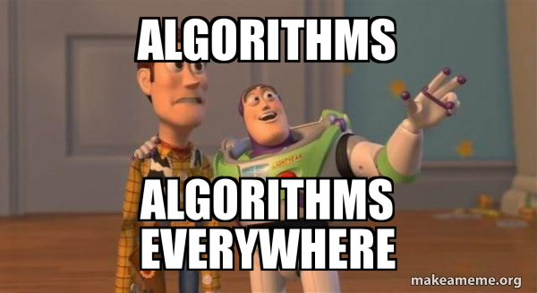

<h1 align="center">Algorithms & Deep Learning Architectures From Scratch</h1> 

 
     

 

<h3 align="center"><b>What I cannot create, I do not understand</b></h3> 

As an AI Research Engineer and a competitive programmer, I want to engage myself with this public repository to implement the most well-known AI architectures and foundational algorithms.

This repository represents a collection of **from-scratch implementations** of essential **Deep Learning architectures** and **Core Data Structures & Algorithms**.

All implementations are written by myself using my own logic to better understand how things work under the hood.

---

## 🚀 Goals

* Reimplement key AI models from scratch
* Implement classic data-structure algorithms using **clean, efficient C++**
* Implement the most well-known AI research papers to gain deeper knowledge in AI
* Build foundational machine learning components **from zero**
* Continuously expand with new architectures and algorithmic techniques

---

## Implemented:

### Linear Algebra

* ✔️ Matrix-Vector Dot Product
* ✔️ Transpose of a Matrix

---

## ⭐ Support

If you find this project useful, consider giving it a **star** ⭐
It helps others discover the repository and motivates further development!

---
